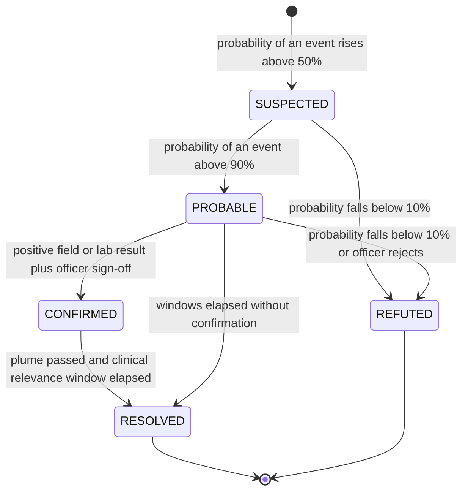
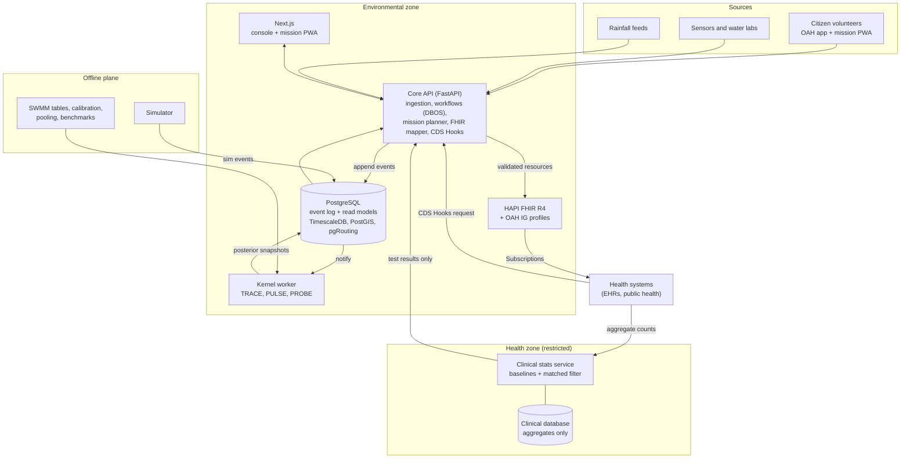
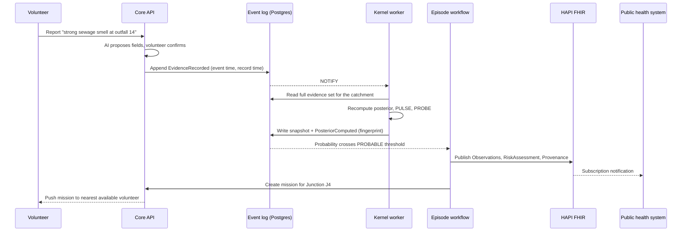

# Upstream — Product Requirements Document

> **From a pollution event in the water to a health signal in the clinic.**
> Tagline: *Don't wait for the outbreak. Follow the exposure.*

| Field | Value |
|---|---|
| Product | Upstream |
| Repository | `upstream-onehealth` (distinct from git's "upstream"; see Risk R10) |
| Document | Product Requirements Document (PRD) |
| Version | 1.0 (draft) |
| Date | 22 September 2026 |
| Owner | Ishaan (product lead) |
| Hackathon | IEEE OneAquaHealth Global Hackathon 2026 |
| Track | **Track 7 — Digital Health Standards** |
| Submission deadline | 30 September 2026, 9:00 pm PDT |
| Status | Draft for team review |

---

## How to read this document

This PRD is written for three kinds of reader.

- **Anyone (judges, mentors, new teammates):** read Sections 1–6. They explain the problem, the idea, why it fits the hackathon, and who uses it, in plain language.
- **Engineers:** Sections 7–13 cover the engine, requirements, architecture, stack, data model and FHIR specification.
- **Everyone before shipping:** Sections 14–20 cover privacy, evaluation, the demo, roadmap, team ownership, risks and open questions.

Technical terms are explained the first time they appear and again in the Glossary (Section 21).

---

## Table of contents

1. [Summary](#1-summary)
2. [The problem](#2-the-problem)
3. [Hackathon fit and track choice](#3-hackathon-fit-and-track-choice)
4. [Goals and non-goals](#4-goals-and-non-goals)
5. [Users and who is responsible for what](#5-users-and-who-is-responsible-for-what)
6. [The core idea: the Exposure Episode](#6-the-core-idea-the-exposure-episode)
7. [How it works: the engine](#7-how-it-works-the-engine)
8. [Functional requirements](#8-functional-requirements)
9. [Non-functional requirements](#9-non-functional-requirements)
10. [System architecture and layer-by-layer flow](#10-system-architecture-and-layer-by-layer-flow)
11. [Tech stack](#11-tech-stack)
12. [Data model](#12-data-model)
13. [Interoperability specification (FHIR and CDS Hooks)](#13-interoperability-specification-fhir-and-cds-hooks)
14. [Privacy, security, safety and ethics](#14-privacy-security-safety-and-ethics)
15. [Evaluation plan](#15-evaluation-plan)
16. [Demo plan](#16-demo-plan)
17. [Roadmap](#17-roadmap)
18. [Build team ownership](#18-build-team-ownership)
19. [Risks and mitigations](#19-risks-and-mitigations)
20. [Open questions](#20-open-questions)
21. [Glossary](#21-glossary)
22. [References](#22-references)

---

## 1. Summary

**Why the name.** *Upstream* has two meanings that describe the product. In a river, upstream is where the engine looks for the source of contamination. In public health, acting upstream means dealing with root causes before people get sick, which is the product's purpose: follow the exposure before the outbreak.

**What it is.** Upstream is an event-driven One Health system for urban streams. When contamination briefly enters a stream (a sewer overflow, a misconnected pipe, an illegal discharge), Upstream works out:

1. **Where it probably came from** (TRACE),
2. **Where it is going and when each downstream area is plausibly exposed** (PULSE),
3. **Where the next observation would reduce uncertainty the most**, and who can take it (PROBE),
4. **When and how this becomes relevant to human health**, and how to tell health systems in the standard language they already use, HL7 FHIR (BRIDGE).

**The central object.** Instead of a static "water is bad" alert, the system maintains an **Exposure Episode**: a time-bounded, evidence-backed hypothesis about one contamination event. Every new piece of evidence, including "I checked here and it looks normal", updates it. The episode is published as validated FHIR resources that extend the official OneAquaHealth FHIR Implementation Guide.

**What makes it different.**

- It turns **sparse, noisy citizen observations** into a probability over sources, not a verdict.
- It uses **negative evidence** ("nothing here") to eliminate whole upstream branches.
- Every number it shows (probabilities, time windows, sample recommendations) is **computed by a transparent model and can be reproduced exactly**.
- It is **evaluated against ground truth** in a simulator, with baselines and calibration checks.
- AI (a language model) is used **only at the edges** to tidy free-text reports. It never makes a decision.

**One sentence pitch.** Upstream is a closed-loop One Health engine that turns citizen and sensor observations of urban streams into computable, standards-based exposure episodes: it traces the likely source, predicts downstream exposure windows, directs the next best sample, and makes the episode usable by health systems through FHIR and CDS Hooks.

**What it is not.** It does not diagnose illness, prove that a patient's illness came from a specific event, or accuse a polluter. It produces an evidence-backed signal so that authorised humans can investigate.

---

## 2. The problem

### 2.1 Three clocks that never meet

When a stream is contaminated, the environment and the health system run on separate clocks with no shared event between them.

```
ENVIRONMENT                                   HEALTH SYSTEM
02:00  Sewer overflow starts
02:20  Contamination enters the stream
04:00  Plume moves downstream
08:00  Children paddle, dogs swim downstream
                                  1–14 days   People fall ill (depends on the pathogen)
                                              Patients visit clinics
                                              Clinician sees symptoms, has no environmental context
```

By the time a clinic sees patients, the water may look clean again. Nobody connects the two.

**Historical example.** In the 1993 Milwaukee *Cryptosporidium* outbreak, an estimated 403,000 people became ill and about 4,400 were hospitalised. The waterborne cause was not recognised for weeks, partly because routine stool tests did not look for *Cryptosporidium*.

### 2.2 Why current monitoring falls short

| Gap | What happens today |
|---|---|
| Events are transient | Illicit discharges can last minutes to hours. By the time a field team arrives, the evidence has gone. |
| The source is unknown | A contaminated reach could be fed by an overflow, a misconnected pipe, an industrial discharge, runoff or something further upstream. |
| Alerts are static | "Zone X is polluted" ignores that contamination moves and has a time window. |
| Citizen data is underused | Citizen reports are sparse, irregular and noisy, so they pile up uninterpreted. "Looks normal" reports are rarely recorded at all. |
| No shared object | Environmental and health systems have no common, machine-readable event to exchange. |
| Sampling is fixed | Samples are taken on schedules, not where they would answer the open question. |

### 2.3 Policy context (European)

- **EU Bathing Water Directive (2006/7/EC)** already defines *short-term pollution*: microbiological contamination with a clearly identifiable cause that is not normally expected to affect water quality for more than about 72 hours. **The Exposure Episode is a computable version of a concept EU law already recognises.**
- **Recast Urban Wastewater Treatment Directive (EU 2024/3019)** strengthens the management of storm-water overflows and introduces wastewater surveillance for public-health parameters, which pushes environmental and health data together.
- **HL7 Europe and the European Health Data Space (EHDS)** make FHIR the common language for health data exchange in Europe.

---

## 3. Hackathon fit and track choice

### 3.1 The hackathon

- **Event:** IEEE OneAquaHealth Global Hackathon 2026, aligned with the EU-funded OneAquaHealth (OAH) project.
- **Problem statement:** *Build solutions that improve urban freshwater ecosystem monitoring and support the One Health vision.*
- **Hackathon tagline:** *From streams to systems: turning citizen science into actionable One Health intelligence.*
- **Judging criteria:** Impact and alignment with the OAH mission; innovation and creativity; architecture; UX; scale (including integration with existing systems).
- **Submission:** track alignment statement, project description, 3–5 minute demo video, public code repository, working prototype.
- **Prizes are overall,** not per track. The track is the lens through which the project is judged.

### 3.2 Chosen track: Track 7 — Digital Health Standards

| Track 7 column | Official text | How Upstream answers it |
|---|---|---|
| Challenge | Enable interoperability across systems | Creates the missing shared object (the Exposure Episode) between environmental monitoring and health systems. |
| Problem | Fragmented data and lack of standards | Citizen reports, sensors, rainfall, lab results and clinical counts are unified into one evidence model and published as FHIR resources that extend the OAH IG. |
| Build | FHIR models, AI agents, integration frameworks | FHIR profiles (FSH), a validated HAPI FHIR server, CDS Hooks service, topic-based Subscriptions, Provenance and AuditEvent, plus a bounded AI normaliser. |

**Why Track 7 and not the others.**

- The project's thesis, "the environment and the clinic have no shared event", is an interoperability problem.
- OAH already publishes an **HL7 FHIR Implementation Guide (R4)** whose stated purpose is to connect the OAH Environmental Surveillance System with public and personal health indicators. Upstream delivers exactly that connection and builds on the guide instead of inventing a parallel model. This scores directly on the *Scale / integration with existing systems* criterion.
- HL7 and EFMI are hackathon sponsors, and the judging panel includes an HL7 Fellow. A rigorously validated FHIR layer is recognised and rewarded; a sloppy one is punished.
- In Track 6 (Resilience Informatics) the FHIR layer would be dead weight. In Track 7, the inference engine is the reason the standard object is worth exchanging.

**Secondary relevance (not the submission track):** Track 6 (early warning: TRACE and PULSE), Track 3 (responsible AI: bounded normaliser with human confirmation), Tracks 1 and 5 (missions give volunteers a purpose and visible impact: "your sample eliminated two of three suspects").

**Condition on the choice:** Track 7 only works if the FHIR layer passes the HL7 validator with zero errors against the OAH IG. If the team cannot commit to that, fall back to Track 6 and demote BRIDGE.

### 3.3 Alignment with the judging criteria

| Criterion | What judges will see |
|---|---|
| Impact and OAH alignment | Citizen observations become actionable; covers human (clinics), animal (dogs, vets) and ecosystem (recurring sources, post-episode bioassessment) health. |
| Innovation | Inverse source inference from sparse citizen evidence; negative evidence; decision-aware sampling (EC²); matched-filter clinical test. |
| Architecture | Event-sourced, reproducible, with a hard health-data boundary and a lean stack. |
| UX | Belief replay slider; missions a volunteer completes in minutes; one-line CDS card for clinicians. |
| Scale | Extends the OAH FHIR IG; standard CDS Hooks and Subscriptions; clear path from a lean stack to a production stack. |

### 3.4 Competitive landscape (public repositories as of 22 September 2026)

| Similar public entries | Overlap | How Upstream differs |
|---|---|---|
| stream-to-clinic (Track 7) | Citizen data to FHIR to clinic alerts | Alerts there come from rule-based patterns. Upstream publishes a computed, versioned episode with a lifecycle, provenance and a clinical time window. |
| AquaPass (Track 7), Catchment (Track 2) | "Which evidence matters next" | Those rank evidence with heuristic weights. Upstream uses a probabilistic model with a near-optimality guarantee, evaluated against baselines. |
| AquaTwin | Downstream spread on a stream graph | That shows reachability. Upstream computes *when* with uncertainty, and infers the source backwards. |
| StreamVitals, riparia (Track 3) | "AI interprets, humans decide" | This stance is now table stakes. Upstream's differentiation is the inference engine and evaluation, not the AI stance. |

Private repositories may exist. The defensible ground is **inverse inference, calibrated exposure windows, a lifecycle-managed episode on the OAH IG, and quantitative evaluation.**

---

## 4. Goals and non-goals

### 4.1 Goals

| ID | Goal | Measure of success |
|---|---|---|
| G1 | Localise the likely source of a transient contamination event from sparse observations | Top-3 source accuracy in simulation (target ≥ 80% after 5 observations) |
| G2 | Produce honest, calibrated exposure windows for downstream zones | 80% credible windows contain the true arrival 75–85% of the time |
| G3 | Reduce the number of samples needed to localise a source | ≥ 30% fewer samples than nearest-site or fixed-schedule baselines |
| G4 | Make episodes usable by health systems via validated FHIR | Zero errors from the HL7 validator against the OAH IG |
| G5 | Detect the health signal earlier when an episode exists | Shorter detection delay than a blind cluster scan, in simulation |
| G6 | Make every conclusion reproducible | Any published episode can be recomputed bit-for-bit from its fingerprint |
| G7 | Engage citizens with meaningful tasks | Missions completed; each mission shows its measured effect on the episode |

Targets are initial proposals and will be adjusted after the first simulation runs.

### 4.2 Non-goals

- Diagnosing disease or attributing a specific patient's illness to a specific event.
- Handling patient-level data on the environmental side.
- Naming or accusing polluters. Outputs are "inspect this outfall" recommendations for authorised officers.
- Replacing the OAH Citizen Science App. Upstream complements it.
- Full hydrodynamic simulation in real time. Physics is precomputed offline.
- Pathogen sequencing or laboratory information management.

---

## 5. Users and who is responsible for what

### 5.1 People who use the system

| Role | Who they are | What they see | What they do |
|---|---|---|---|
| Citizen volunteer | Residents, students, stream groups using the OAH app | Their reports, missions near them, the effect of their contributions | Report observations (including "looks normal"), accept missions, confirm AI-structured fields |
| Field / environmental officer | Municipal or water-utility staff | Active episodes, source ranking, recommended samples and inspections | Take field and lab samples, inspect outfalls, sign off episodes as CONFIRMED |
| Environmental agency analyst | Regional environment or water authority | Recurring-source reports, episode history per stream reach | Plan repairs of misconnections and overflows; feed restoration planning (OAH Decision Support System) |
| Public health officer | Regional public-health authority | Episodes affecting their area, cross-domain signals | Decide advisories (for example "avoid contact with this stream"), open investigations |
| Clinician | GP or hospital doctor using a FHIR-enabled EHR | A short CDS card when a patient's context matches an active episode | Decide whether to order pathogen-specific tests; report to public health |
| Researcher | OAH scientists | Exports of episodes and evidence | Analyse patterns across cities |
| System administrator | Team or host organisation | Health of services, audit logs | Operate, back up, manage access |

### 5.2 Decision rights: the system recommends, humans decide

| Decision | Who decides | What the system provides |
|---|---|---|
| Is there probably an event? | System (automated state change to SUSPECTED / PROBABLE) | Posterior probability and evidence trail |
| Is the event CONFIRMED? | Field / environmental officer | Lab or field-test result plus posterior |
| Where to sample next | Officer or volunteer (accept or reject mission) | Ranked recommendations with expected value and time window |
| Issue a public advisory | Public health officer | Exposure windows per zone with uncertainty |
| Inspect or repair a suspected source | Environmental agency | Source ranking, recurring-source evidence |
| Order a test for a patient | Clinician | Context card with the relevant time window |
| Open an outbreak investigation | Public health officer | Cross-domain signal with test statistics |

**Rule:** The system never issues advisories, never contacts patients, and never names a polluter. It changes states and makes recommendations; accountable humans act.

---

## 6. The core idea: the Exposure Episode

### 6.1 What an Exposure Episode is

An **Exposure Episode** is the system's current best, evidence-backed understanding of one contamination event. It is a living hypothesis, not a static record.

```
EXPOSURE EPISODE  EE-2841            State: PROBABLE
Started (estimated):   02:10–02:20
Likely source:         Outfall O14 (71%), Outfall O9 (19%), other (10%)
Path:                  O14 → J9 → Stream reach R3 → Park zone A
Exposure windows (80% credible):
    Zone A  02:30–03:15   Zone B  03:05–04:40   Zone C  04:10–05:30
Clinical relevance:    until about 16 days after exposure (pathogen-dependent)
Pathways:              Recreation (paddling), dog contact, floodwater
Evidence:              3 citizen reports (1 negative), 2 sensor anomalies,
                       1 overflow activation, rainfall 68 mm/h
Next best sample:      Junction J4 within the next 17 minutes
Fingerprint:           sha256:9f2c… (reproducible)
```

### 6.2 What it contains

| Part | Contents |
|---|---|
| Event | Estimated start time, duration, trigger |
| Source | Probability for each candidate entry point, plus "diffuse runoff" and "no event" |
| Propagation | Paths downstream and travel-time distributions |
| Exposure | Zones, time windows with uncertainty, exposure pathways |
| Evidence | Every observation used, positive and negative, with who, how and when |
| Health relevance | Clinical relevance window, plausible pathogen classes, related clinical signals |
| Interoperability | FHIR resources, versions, provenance, audit trail |
| Fingerprint | Hash of the evidence set, network version, kernel version and parameter version |

### 6.3 Lifecycle



Thresholds are initial, configurable values and will be tuned using simulation (Section 15). Any later evidence (including a late lab result) can reopen an episode; the history is preserved.

---

## 7. How it works: the engine

### 7.1 The idea in plain language

Think of a detective working a case.

- There is a list of **suspects**: every place contamination could have entered the stream, at every possible start time and duration, plus "diffuse runoff" and "nothing happened".
- Each piece of **evidence** makes some suspects more likely and others less likely. A sewage smell at a point supports suspects upstream of it at the right time. A "looks normal" check rules out suspects whose contamination should have been passing that point then.
- Every time new evidence arrives, the detective **re-reads the whole case file** and rewrites the odds.
- From the odds, the detective can say **where the contamination is heading**, **which single extra check would help most**, and **how long people downstream should be watched for illness**.

That is the whole engine: **one set of odds (the posterior) and four things you do with it.**

### 7.2 The model (for engineers)

**Stream network.** The drainage and stream network is a directed graph built from OpenStreetMap waterways and known outfalls and overflows for a real OAH pilot catchment. It is "compiled" into arrays (topological order, adjacency, edge lengths, upstream sets, travel-time tables). Each compiled network has a version hash.

**Hypotheses.** A hypothesis is *h* = (entry node, start time, duration). Example size: 40 entry points × 96 fifteen-minute start bins × 3 duration classes ≈ 11,500 hypotheses. Two special hypotheses are added: **diffuse runoff** (rain washing pollutants in along many reaches) and **no event**.

**Forward model (physics).** For each hypothesis, the model predicts when contamination passes each downstream node and at what concentration:

- **Travel time:** edge length ÷ velocity, where velocity comes from precomputed EPA SWMM runs for the current flow condition (set by rainfall; see 7.9), with uncertainty.
- **Spreading:** the plume widens as it travels (dispersion grows with the square root of travel time).
- **Dilution:** at each confluence, concentration is mixed in proportion to the flows.
- **Die-off:** bacteria decay over time (first-order decay).

**Likelihood of each observation.** Each observation type (smell report, foam photo, test strip, sensor, lab count) has a detection curve: the probability of a positive result given the predicted concentration at that place and time, plus a false-positive rate. A report far downstream after dilution therefore counts for less, automatically. Each observer also has a reliability score learned from past verified outcomes.

**Negative evidence.** "Checked, looks normal" and "sensor normal for these 15 minutes" are recorded as evidence. They are often the most informative observations, because they rule out whole upstream branches for a time slice.

**Prior.** Before any evidence, each entry point has a base rate informed by its type (overflow, known outfall), rainfall (overflows are far more likely during heavy rain), past episodes at that point, and slow ecological indicators from OAH (for example diatom deformities or poor macroinvertebrate scores signal chronic pressure on a reach).

**Posterior.** Posterior ∝ prior × product of all observation likelihoods. It is computed exactly over all hypotheses.

**Recompute, don't update.** On every new, late or retracted piece of evidence, the posterior is recomputed from the full evidence set. At about 11,500 hypotheses and a few hundred observations, this is a few million multiplications, which takes milliseconds with JAX. Late data and retractions are not special cases, and results are deterministic.

### 7.3 TRACE — where did it come from?

- **Output:** probability for each candidate entry point (summing over start times and durations), grouped into "source corridors".
- **Explanation:** for each top candidate, the observations that most supported it and the observations that eliminated its rivals. This explanation is computed from the model, not written by an AI.

### 7.4 PULSE — where is it going, and when?

- Pushes the posterior forward through the network to every downstream **receptor zone** (play areas, paths used by dog walkers, allotments irrigating from the stream, flood-prone streets).
- **Output:** for each zone, the probability of exposure over time and an **80% credible window**, for example "Zone B 03:05–04:40".
- Exposure pathways are attached from zone attributes (recreation, animal contact, floodwater, irrigation).

### 7.5 PROBE — where should the next observation be?

- **Candidates:** (node, time) pairs that a volunteer or officer can reach **while the plume could still be passing** that node.
- **Selection method: EC²** (Equivalence Class Edge Cutting). Hypotheses are grouped by the **decision** they would lead to, and the system only spends samples telling apart groups that lead to different decisions. Greedy selection with EC² is provably near-optimal, unlike plain information gain.
- **Two modes:**
  - **Protect:** groups are "which zones need a warning". Used for public health.
  - **Enforce:** groups are "which outfall should be inspected". Used for finding the polluter.
- **Routing:** OR-Tools assigns the chosen points to available people and routes them (walking times from pgRouting on OpenStreetMap footpaths), respecting each point's time window.
- **Safety constraints:** no missions during high flow or flood warnings, daylight only, only at public access points.
- **Output:** a mission ("Check Junction J4 between 02:22 and 02:39; test: smell, colour, test strip") with the expected effect shown to the volunteer.

### 7.6 BRIDGE — when does it matter for health, and who needs to know?

**Clinical relevance window.** Fecal indicators do not say which pathogen is present. The system therefore combines the exposure window with the **incubation periods** of pathogen classes plausible for the source type:

| Pathogen class (sewage-related unless noted) | Typical incubation (approximate) |
|---|---|
| Norovirus | 12–48 hours |
| Campylobacter | 2–5 days |
| Shiga-toxin E. coli | 3–4 days (1–10) |
| Cryptosporidium | about 7 days (2–10) |
| Giardia | 1–2 weeks |
| Leptospira (floodwater, animal urine) | 5–14 days (2–30) |

The episode therefore stays clinically relevant for roughly two weeks or more after the water clears. This window drives when CDS cards are shown and when the clinical test runs.

**CDS card for clinicians.** When a clinician opens a patient record, the CDS Hooks service checks three conditions: the patient's coarse area overlaps an episode's exposure zone, the encounter falls inside the clinical relevance window, and the reason for the visit matches a relevant syndrome (for example acute gastroenteritis, fever after floodwater contact). Only then does it return a card. The card's value is **prompting a pathogen-specific test that is not in routine panels**, which is exactly what was missing in Milwaukee. The card is context, not a diagnosis.

**Clinical signal (matched filter).** In the separate health zone, the clinical stats service receives **aggregate daily syndrome counts per area** (never patient records). For each active episode, it knows the *shape* the case curve should have (exposure window blurred by the incubation distributions) and tests for that specific shape above a baseline. Looking for a known shape is far more sensitive than searching blindly for clusters, like listening for a known voice in a noisy room.

- **Output:** a test result such as "excess matching episode EE-2841's predicted curve, p = 0.003". This is a reason to investigate, not a conclusion.
- **Reverse direction:** a clinical cluster with no matching episode triggers a space-time scan and asks the kernel to search upstream of the affected areas.

**Publishing.** The episode is mapped to FHIR resources on the OAH IG and pushed to HAPI FHIR. Public health systems subscribe to episode state changes (Section 13).

### 7.7 Multi-episode pooling — the ecosystem leg

Misconnected pipes and overflows **recur at the same place**. A single citizen-driven episode may leave the source unclear, but combining evidence across episodes that probably share a source sharpens localisation over weeks.

- Runs nightly over closed episodes.
- Updates each entry point's prior for future episodes.
- Produces a **recurring-source report** for the environmental agency and the OAH Decision Support System: fixing that pipe is a restoration measure.
- After a confirmed episode, the system schedules a **post-episode bioassessment mission** (for example 2–4 weeks later) so citizens measure ecological impact.

This connects acute events to chronic ecosystem pressure, completing the One Health triangle (human, animal, ecosystem).

### 7.8 Where AI is and is not used

| Task | Method | AI (language model)? |
|---|---|---|
| Turning free text or a photo into structured observation fields | Language model with a fixed schema; the citizen confirms every field; Provenance records model and version | Yes, proposals only |
| Source inference, exposure windows, sampling choice | Exact Bayesian computation, physics tables, EC² | No |
| Observer reliability, detection curves, velocity calibration | Hierarchical Bayesian models (NumPyro), offline | No (statistical learning) |
| Clinical signal | Statistical test (negative-binomial baseline, matched filter) | No |
| Explanations in the UI | Templates filled from computed values; every number checked against engine state | Optional wording only |
| Episode state changes and publishing | Rules and human sign-off | No |

**Principle:** *AI proposes, physics and statistics compute, rules validate, FHIR standardises, humans decide.*

### 7.9 How rainfall data is used

Rainfall is not a warning signal on its own. It changes the physics and the odds in five ways:

1. **Source prior.** Overflows mostly activate during heavy rain, so rain raises the prior for overflow points. Conversely, a contamination event in **dry weather** points strongly towards misconnections or illegal discharges.
2. **Travel times and dilution.** Rainfall sets the flow condition, which selects the matching precomputed SWMM table: faster flow means earlier arrival and more dilution.
3. **Diffuse-runoff hypothesis.** The first rain after a dry spell washes accumulated pollutants off streets ("first flush"). This competes with point sources, so the system does not blame an outfall for what is really runoff.
4. **Exposure pathways.** Heavy rain adds floodwater contact as a pathway for affected zones.
5. **Mission safety.** High flow or flood warnings block missions at affected points.

**Sources:** open weather APIs (for example Open-Meteo) and national radar or gauge feeds where available. Rainfall is stored as per-catchment averages every 15 minutes.

---

## 8. Functional requirements

Priority: **P0** = required for the hackathon MVP, **P1** = strongly desired, **P2** = later.

### 8.1 Ingestion and evidence

| ID | Requirement | Priority |
|---|---|---|
| FR-1 | Accept citizen reports (location, time observed, free text, optional photo, optional test-strip values). | P0 |
| FR-2 | Accept explicit **negative** reports ("checked, looks normal"). | P0 |
| FR-3 | Convert free text or photo into candidate structured fields using OAH codes; the citizen must confirm before the evidence is used. | P0 |
| FR-4 | Record two times for every observation: when it happened (event time) and when the system learned it (record time). | P0 |
| FR-5 | Snap every observation to the nearest network node within a configurable distance; reject or flag observations too far away. | P0 |
| FR-6 | Ingest sensor readings and emit anomaly evidence and "normal for this window" evidence every 15 minutes. | P1 |
| FR-7 | Ingest rainfall per catchment every 15 minutes. | P0 |
| FR-8 | Ingest overflow activation signals where available. | P1 |
| FR-9 | Ingest field and lab results, including results that arrive days later. | P0 |
| FR-10 | Allow any observation to be retracted with a reason; retraction is a new event, not a deletion. | P0 |

### 8.2 Inference (TRACE, PULSE, PROBE)

| ID | Requirement | Priority |
|---|---|---|
| FR-11 | Compute the exact posterior over all hypotheses, including "diffuse runoff" and "no event", on every evidence change. | P0 |
| FR-12 | Open a SUSPECTED episode automatically when the probability of an event exceeds the threshold. | P0 |
| FR-13 | Rank source corridors with probabilities and a computed explanation. | P0 |
| FR-14 | Compute per-zone exposure probability over time and 80% credible windows. | P0 |
| FR-15 | Recommend the next best observation using EC², in Protect and Enforce modes. | P0 |
| FR-16 | Only recommend observations reachable within the plume's passage window and allowed by safety rules. | P0 |
| FR-17 | Assign recommendations to available volunteers or officers and route them. | P1 |
| FR-18 | Store a fingerprinted snapshot of every posterior. | P0 |
| FR-19 | Pool evidence across closed episodes to identify recurring sources and update priors. | P1 |

### 8.3 Episode workflow

| ID | Requirement | Priority |
|---|---|---|
| FR-20 | Manage episode states and transitions (Section 6.3). | P0 |
| FR-21 | Require officer sign-off plus a positive field or lab result for CONFIRMED. | P0 |
| FR-22 | Keep an episode clinically relevant until its clinical relevance window ends, then resolve it. | P0 |
| FR-23 | Re-plan PROBE if a requested sample is not returned within its window. | P1 |
| FR-24 | Schedule a post-episode bioassessment mission after CONFIRMED episodes. | P1 |

### 8.4 Interoperability

| ID | Requirement | Priority |
|---|---|---|
| FR-25 | Map evidence and episodes to FHIR R4 resources profiled on the OAH IG. | P0 |
| FR-26 | Validate every resource against the profiles; zero validator errors in CI. | P0 |
| FR-27 | Attach Provenance to every episode version and every AI-assisted observation. | P0 |
| FR-28 | Provide a CDS Hooks service (`patient-view`, `encounter-start`) returning cards only when location, time window and syndrome all match. | P0 |
| FR-29 | Notify subscribed public-health systems of episode state changes (topic-based Subscriptions). | P1 |
| FR-30 | Record an AuditEvent for every CDS card served and every external read. | P1 |
| FR-31 | Represent sampling missions as FHIR Task resources for external field systems. | P2 |

### 8.5 Clinical signal (health zone)

| ID | Requirement | Priority |
|---|---|---|
| FR-32 | Accept aggregate syndrome counts per area per day as FHIR MeasureReport; suppress small counts. | P0 |
| FR-33 | Maintain seasonal and day-of-week baselines per area and syndrome. | P0 |
| FR-34 | Run the matched-filter test for every active episode daily and publish only the test result. | P0 |
| FR-35 | Detect unexplained clusters and request an upstream search from the kernel. | P1 |

### 8.6 Interfaces

| ID | Requirement | Priority |
|---|---|---|
| FR-36 | Operator console: map of the network with source probabilities, animated exposure windows, evidence list, episode state. | P0 |
| FR-37 | **Belief replay:** a time slider showing what the system believed at any past moment. | P0 |
| FR-38 | Mission app (PWA): receive, accept or decline missions; submit results offline; see the effect of each contribution. | P0 |
| FR-39 | Public-health view: episodes, exposure windows, clinical test results. | P1 |
| FR-40 | SMART on FHIR app showing episode details inside an EHR. | P2 |
| FR-41 | Export episodes and evidence as Parquet for researchers. | P1 |

### 8.7 Simulation and evaluation

| ID | Requirement | Priority |
|---|---|---|
| FR-42 | Simulator that injects events on the real network and generates realistic citizen, sensor and clinical data. | P0 |
| FR-43 | Hide ground truth from the kernel (separate schema, no access). | P0 |
| FR-44 | Benchmark suite with metrics and baselines (Section 15), run on every change. | P0 |
| FR-45 | Block changes that degrade calibration beyond tolerance. | P1 |

---

## 9. Non-functional requirements

| ID | Area | Requirement |
|---|---|---|
| NFR-1 | Latency | New evidence to updated posterior: under 5 seconds at the 95th percentile for a single catchment. |
| NFR-2 | CDS latency | CDS Hooks responses under 500 ms (clinicians are waiting). |
| NFR-3 | Reproducibility | Any posterior can be recomputed bit-for-bit from its fingerprint (deterministic CPU execution, pinned versions). |
| NFR-4 | Auditability | Nothing is ever deleted; retractions and corrections are new events. Every published FHIR resource links to its evidence. |
| NFR-5 | Privacy | No patient-level data outside the health zone. Only aggregates enter; only test results leave. |
| NFR-6 | Calibration | Stated probabilities must be calibrated in simulation (Section 15). |
| NFR-7 | Standards | FHIR R4, OAH IG, CDS Hooks, SMART App Launch, UCUM units, SNOMED CT and LOINC where licensed. |
| NFR-8 | Availability | Ingestion must accept reports even if the kernel is down; the kernel catches up from the log. |
| NFR-9 | Offline | The mission app works without signal and syncs later with correct event times. |
| NFR-10 | Accessibility | WCAG 2.1 AA for the console and mission app; plain-language labels. |
| NFR-11 | Data residency | Hosted in the EU. |
| NFR-12 | Openness | Source code public; open formats (Parquet, FHIR JSON). |

---

## 10. System architecture and layer-by-layer flow

### 10.1 Design principles, and the problem property behind each

| Property of the problem | Design decision |
|---|---|
| Evidence arrives late and out of order (lab results take days) | Store two times per fact; recompute the posterior from the full evidence set |
| Every conclusion must be reproducible and auditable | An append-only event log is the single source of truth; posteriors are fingerprinted |
| Evidence can be wrong | Retractions are events; nothing is deleted |
| Timescales run from minutes (plume) to weeks (clinical window, ecological follow-up) | Durable workflows with timers that survive restarts |
| Environmental data is shareable; health data is sensitive | A hard boundary: separate service, database and credentials for health data |
| The engine must be evaluated on simulated data | The simulator writes to the same log as real sources |

Everything else (the FHIR server, the map, exports) is a **view** built from the event log and can be rebuilt from it.

### 10.2 Architecture diagram (lean deployment)



### 10.3 Components and responsibilities

| Component | Responsible for | Writes | Reads | Never does |
|---|---|---|---|---|
| Core API | Ingestion, validation, AI normalisation with confirmation, snapping to the network, episode workflows, mission assignment, FHIR mapping, CDS Hooks | Events, missions, workflow state | Read models, posterior snapshots, test results | Compute probabilities; store patient data |
| Kernel worker | TRACE, PULSE, PROBE candidate selection, episode detection | Posterior snapshots, `PosteriorComputed` events | Evidence events, compiled network, parameter tables | Talk to health systems; change episode states |
| PostgreSQL (environmental DB) | Source of truth and read models | — | — | Hold clinical data |
| HAPI FHIR | Serve and validate FHIR resources; Subscriptions | FHIR store (a rebuildable view) | — | Act as the source of truth |
| Clinical stats service | Baselines, matched-filter tests, cluster detection | Clinical database, test results | Aggregate counts; episode windows (read-only API) | Send counts or patient data out |
| Next.js app | Console, belief replay, mission PWA, public-health view | — (via API) | API | Hold business logic |
| Simulator | Generate synthetic events and ground truth | `sim` events, ground-truth schema | Compiled network | Share ground truth with the kernel |
| Offline jobs | Network compiler, SWMM tables, calibration, pooling, benchmarks | Versioned artifacts, reports | Event log, exports | Run in the request path |

### 10.4 Layer-by-layer flow

**Layer 0 — Sources.** Citizens (OAH app and mission PWA), sensors, water labs, overflow signals, rainfall feeds. Health systems are a separate source that only reaches the health zone.

**Layer 1 — Ingestion (Core API).**
1. Receive a report, reading, or result.
2. Validate the schema and plausibility (location inside the catchment, time not in the future).
3. For free text or photos: the language model proposes structured fields; the citizen confirms; a Provenance record notes the model and version.
4. Snap the location to the nearest network node.
5. Append an `EvidenceRecorded` event with event time and record time.

**Layer 2 — Event log (PostgreSQL).** The append-only `events` table is the single source of truth. Every downstream table is derived from it. A Postgres `NOTIFY` wakes consumers; each consumer tracks its position.

**Layer 3 — Derived evidence (scheduled jobs in the Core API).**
- Timescale continuous aggregates summarise sensor readings every 15 minutes; a job emits anomaly evidence or "normal window" evidence.
- Rainfall is averaged per catchment and appended as `RainfallObserved` events.

**Layer 4 — Inference (Kernel worker).**
1. Wake on new events for a catchment.
2. Load the full evidence set for the relevant time horizon and the compiled network for the current flow condition.
3. Recompute the posterior over all hypotheses (TRACE).
4. Push it downstream to receptor zones (PULSE).
5. Score reachable sample candidates with EC² (PROBE).
6. Write a fingerprinted snapshot and a `PosteriorComputed` event.

**Layer 5 — Episode workflows (DBOS inside the Core API).**
1. React to `PosteriorComputed`: open, advance or refute episodes by threshold.
2. Request officer sign-off for CONFIRMED.
3. Start timers: sample return deadlines, end of the clinical relevance window, post-episode bioassessment.
4. Trigger publishing and missions.

**Layer 6 — Action and interoperability (Core API + HAPI).**
- **Missions:** OR-Tools assigns PROBE candidates to available people using pgRouting walking times, then sends push notifications to the PWA.
- **FHIR:** the mapper converts the episode and evidence into OAH-profiled resources, validates them, and writes them to HAPI with Provenance.
- **Subscriptions:** HAPI notifies subscribed public-health systems of state changes.
- **CDS Hooks:** the endpoint holds active episode zones in memory, checks the three conditions, returns a card, and logs an AuditEvent.

**Layer 7 — Health zone (Clinical stats service).** Receives aggregate counts, updates baselines, runs the matched-filter test for each active episode, and sends back only test results. It can ask the kernel for an upstream search when it finds an unexplained cluster.

**Layer 8 — Presentation (Next.js).** Map, episode timeline, **belief replay slider**, evidence list with explanations, mission app, public-health view.

**Layer 9 — Offline plane.** Network compiler, SWMM ensemble runs into travel-time tables, NumPyro calibration, multi-episode pooling, simulator and benchmark suite (run in CI on every change).

### 10.5 End-to-end walkthrough (example incident)

| Time | What happens | Layer and component |
|---|---|---|
| 02:10 | Rainfall reaches 68 mm/h | L3: `RainfallObserved`; overflow priors rise |
| 02:14 | Sensor N14 shows turbidity up, conductivity down | L3: anomaly evidence |
| 02:16 | Overflow at O14 reports activation | L1: evidence |
| 02:17 | Citizen: "strong sewage smell near outfall 14" | L1: AI proposes fields, citizen confirms |
| 02:17 | Posterior recomputed; episode opens as SUSPECTED | L4 kernel, L5 workflow |
| 02:19 | TRACE: O14 71%, O9 19%, other 10% | L4 |
| 02:21 | PULSE: Zone A 02:30–03:15, Zone B 03:05–04:40 | L4 |
| 02:22 | PROBE: check Junction J4 before 02:39; mission sent | L4 → L6 |
| 02:31 | Volunteer at J4: "looks normal" | L1: negative evidence; O9 branch eliminated |
| 02:31 | Episode becomes PROBABLE; FHIR resources published | L5 → L6; Subscription to public health |
| 02:40 | Officer's field test at O14 positive; sign-off | L5: CONFIRMED |
| Days 1–14 | CDS cards shown for matching patients | L6 CDS Hooks |
| Day 3 | Aggregate GI counts in Zone B match the predicted curve | L7: test result sent back |
| Day 16 | Clinical window ends; episode RESOLVED | L5 timer |
| Week 4 | Post-episode bioassessment mission | L5 timer → L6 |
| Nightly | O14 flagged as a recurring source across episodes | L9 pooling → report |

### 10.6 Sequence: from one report to health systems



---

## 11. Tech stack

### 11.1 Lean deployment: 6 containers, 4 technologies

| # | Container | Technology | Why this choice |
|---|---|---|---|
| 1 | Database | PostgreSQL 17 + TimescaleDB + PostGIS + pgRouting | One database does the event log, time series (hypertables, continuous aggregates, compression), geography, walking routes, workflow state and HAPI's storage. Time and space can be joined in one SQL query. Events and read models are written in one transaction, so there are no dual-write bugs. |
| 2 | Core API | Python 3.12, FastAPI, DBOS Transact | Python matches the scientific core. DBOS stores durable workflows and timers (days to weeks) inside Postgres, with no extra server. |
| 3 | Kernel worker | Python, JAX, rustworkx | Exact, vectorised, JIT-compiled posterior computation. Deterministic on CPU. Same codebase as the Core API, different entrypoint. |
| 4 | Clinical stats service | Python, statsmodels | Standard negative-binomial baselines and the matched-filter test. Separate container and separate database for the health boundary. |
| 5 | FHIR server | HAPI FHIR JPA (R4) with the OAH IG package | Open-source reference server; validates against loaded IGs on write; supports Subscriptions. |
| 6 | Web | Next.js, MapLibre GL, deck.gl, PMTiles basemap | One app for the console and the offline-capable mission PWA. deck.gl animates probability along network edges over time. |

**Production addition:** Keycloak for OIDC and SMART on FHIR scopes. In development, use the public SMART launcher and CDS Hooks sandbox.

**Storage for files:** an S3-compatible bucket (or a local volume in development) for photos and raw rainfall files.

### 11.2 Libraries and tools (not separate systems)

| Purpose | Library / tool |
|---|---|
| Hydraulics | EPA SWMM via PySWMM (offline ensembles into lookup tables) |
| Network building | OpenStreetMap data, OSMnx, rustworkx |
| Parameter learning | NumPyro (observer reliability, detection curves, velocity calibration) |
| Sampling and routing | EC² (own implementation), Google OR-Tools |
| Schemas | Pydantic models; JSON Schema exported for TypeScript types |
| Analytics and exports | DuckDB, Parquet |
| FHIR authoring | FHIR Shorthand (FSH), SUSHI, IG Publisher, HL7 FHIR validator |
| AI normaliser | A multimodal language model behind an adapter, with schema-constrained output |
| CI and evaluation | GitHub Actions, pytest, benchmark scripts |
| Local and hosted deployment | Docker Compose on one EU-hosted VM |

### 11.3 What was deliberately left out, and where its job went

| Left out | Its job | Now handled by |
|---|---|---|
| Kafka, schema registry | Ordered, replayable log | Append-only Postgres `events` table |
| Flink | Late data, windowing | Recompute design (late data) and Timescale continuous aggregates (windows) |
| Temporal | Durable timers and sign-offs | DBOS in Postgres |
| Dagster, MLflow | Pipelines and benchmark tracking | CLI scripts in GitHub Actions |
| Iceberg, Trino | Research access | Parquet exports and DuckDB |
| Routing server | Walking times | pgRouting |
| Tile server | Map tiles | GeoJSON from the API; static PMTiles basemap |
| Terminology server | Code systems | Pre-expanded value sets from the IG, served by HAPI |
| Graph database | Network queries | Compiled arrays in memory; PostGIS for geometry |
| Kubernetes and observability stack | Operations | Docker Compose; structured logs |

### 11.4 Scale path

The kernel depends only on an `EventStore` interface (`append`, `read_from(seq)`), so each piece can be swapped without touching the core.

| Add | When |
|---|---|
| Kafka (or Redpanda) | Thousands of events per second, or several independent consuming teams |
| Flink | High-frequency sensor networks across many cities |
| Temporal | Workflows spanning many services |
| Kubernetes | Multi-city tenancy and isolation |
| Martin tile server | Networks larger than about 100,000 edges |
| Apache Iceberg | Researchers need self-service access to years of history |
| A graph neural network proposal generator | City-scale networks with multiple simultaneous sources (proposals are always re-scored by the exact model) |

---

## 12. Data model

### 12.1 Environmental database (overview)

| Table | Type | Purpose |
|---|---|---|
| `events` | Append-only table | Single source of truth for everything that happened or was learned |
| `consumer_positions` | Table | Last event sequence processed by each consumer |
| `network_nodes`, `network_edges`, `outfalls`, `receptor_zones` | PostGIS tables | Stream network geometry and attributes (versioned) |
| `sensor_readings` | Timescale hypertable | Raw sensor values; compressed after 7 days |
| `rainfall` | Timescale hypertable | Per-catchment rainfall every 15 minutes |
| `posterior_snapshots` | Timescale hypertable | Every computed posterior, for belief replay |
| `episodes` | Read model | Current state of each episode |
| `missions` | Read model | Sampling missions and their status |
| `volunteers` | Table | Opt-in profile, coarse availability area, reliability score |
| `sim_truth` (separate schema) | Table | Simulator ground truth; the kernel role has no access |

The **clinical database** is a separate Postgres database with its own role: `syndromic_counts` (hypertable), `baselines`, `test_results`.

### 12.2 The event log

```sql
CREATE TABLE events (
  seq            BIGINT GENERATED ALWAYS AS IDENTITY PRIMARY KEY,
  event_id       UUID        NOT NULL UNIQUE,
  stream         TEXT        NOT NULL CHECK (stream IN ('live', 'sim')),
  catchment_id   TEXT        NOT NULL,
  event_type     TEXT        NOT NULL,
  schema_version INT         NOT NULL,
  event_time     TIMESTAMPTZ NOT NULL,              -- when it happened
  recorded_at    TIMESTAMPTZ NOT NULL DEFAULT now(),-- when we learned it
  payload        JSONB       NOT NULL,
  causation_id   UUID,
  correlation_id UUID
);

REVOKE UPDATE, DELETE ON events FROM app_role;  -- append-only
```

**Ordering rule (important).** Sequence numbers are assigned at insert, not at commit. Without care, a slow transaction holding sequence 101 can commit after 102, and a consumer that has moved past 102 would skip 101 forever. All appends therefore go through one function that takes a transaction-level advisory lock, so commit order always matches sequence order:

```sql
CREATE FUNCTION append_event(p_event_id UUID, p_stream TEXT, p_catchment TEXT,
                             p_type TEXT, p_version INT, p_event_time TIMESTAMPTZ,
                             p_payload JSONB, p_causation UUID, p_correlation UUID)
RETURNS BIGINT LANGUAGE plpgsql AS $$
DECLARE new_seq BIGINT;
BEGIN
  PERFORM pg_advisory_xact_lock(424242);
  INSERT INTO events (event_id, stream, catchment_id, event_type, schema_version,
                      event_time, payload, causation_id, correlation_id)
  VALUES (p_event_id, p_stream, p_catchment, p_type, p_version,
          p_event_time, p_payload, p_causation, p_correlation)
  RETURNING seq INTO new_seq;
  PERFORM pg_notify('events', p_catchment);
  RETURN new_seq;
END $$;
```

At the expected volume (a few events per second at most), the lock costs nothing.

### 12.3 Event types

| Event | Emitted by | Meaning |
|---|---|---|
| `EvidenceRecorded` | Core API, derived-evidence jobs | A positive, negative or measured observation |
| `EvidenceRetracted` | Core API | An observation should no longer be used (with reason) |
| `RainfallObserved` | Rainfall job | Catchment rainfall for a 15-minute interval |
| `OverflowActivated` | Core API | An overflow reported activation |
| `PosteriorComputed` | Kernel worker | New posterior snapshot with fingerprint |
| `EpisodeOpened`, `EpisodeStateChanged` | Episode workflow | Lifecycle changes |
| `SignOffRequested`, `SignOffGiven` | Episode workflow, officer | Human confirmation |
| `MissionCreated`, `MissionAccepted`, `MissionCompleted`, `MissionExpired` | Core API | Sampling missions |
| `FhirPublished` | Core API | Resources published, with FHIR version IDs |
| `ClinicalTestResult` | Clinical stats service | Matched-filter or cluster result (no counts) |
| `UpstreamSearchRequested` | Clinical stats service | Unexplained cluster; kernel should search upstream |
| `NetworkVersionPublished`, `ParametersVersionPublished` | Offline jobs | New compiled network or calibration |

### 12.4 Evidence payload

```json
{
  "node_id": "J4",
  "method": "citizen_visual_olfactory",
  "result": "negative",
  "value": null,
  "unit": null,
  "observer_id": "vol-1182",
  "observer_type": "citizen",
  "snap_distance_m": 12.5,
  "oah_codes": ["<OAH indicator code>"],
  "ai_assisted": true,
  "confirmed_by_observer": true,
  "photo_uri": "s3://upstream-media/…/img.jpg",
  "mission_id": "M-3310"
}
```

### 12.5 Posterior snapshot and fingerprint

| Field | Meaning |
|---|---|
| `fingerprint` | SHA-256 of: sorted evidence IDs and versions, network version, kernel version, parameter version, stream |
| `episode_id`, `catchment_id` | What it describes |
| `as_of_seq`, `recorded_at` | Log position and time of computation (enables belief replay) |
| `p_event` | Probability that any event is happening |
| `source_marginals` | Probability per entry point and for diffuse runoff |
| `zone_windows` | Per-zone exposure probability curve and 80% window |
| `probe_candidates` | Ranked sample recommendations with expected value and time window |

**Belief replay** = select the latest snapshot with `recorded_at` ≤ the chosen moment.

---

## 13. Interoperability specification (FHIR and CDS Hooks)

### 13.1 Principles

- **FHIR R4**, building on the **OneAquaHealth FHIR IG** (package `hl7.eu.fhir.oah`). Where the OAH IG has a profile, use or derive from it; do not invent parallel models.
- FHIR is a **published view**, not the internal database. HAPI can be rebuilt from the event log.
- Every published resource must **pass the HL7 validator** with zero errors, in CI and on write.
- Codes: OAH code systems for indicators; SNOMED CT for syndromes where licensed; LOINC for lab tests; UCUM for units. New concepts (episode state, exposure pathway, observation method, source type) go in a local code system and are proposed to the OAH temporary code system.

### 13.2 Resource mapping

| Concept | FHIR resource | Key elements |
|---|---|---|
| Network node, outfall, receptor zone | `Location` | `position`; zone polygon via the `location-boundary-geojson` extension; type code |
| Evidence | `Observation` (derived from OAH observation profiles) | `subject` = Location; `effectiveDateTime` = event time; `issued` = record time; `status` = `final`, or `entered-in-error` on retraction; performer or device |
| Population of an exposure zone | `Group` (derived from the OAH group profile) | Zone reference, population estimate labelled as an upper bound |
| Exposure Episode | `RiskAssessment` | See 13.3 |
| Why a result exists | `Provenance` | Target = RiskAssessment version; agents = kernel version, AI model (for assisted observations), confirming citizen or officer; entities = evidence Observations; fingerprint |
| Access log | `AuditEvent` (IHE Basic Audit Log Patterns) | Every CDS card served, every external read |
| Aggregate syndrome counts (health zone input) | `MeasureReport` | Area, day, syndrome, count (small counts suppressed) |
| Notifications | Topic-based `Subscription` (R5 Backport IG for R4) | Topic: episode state change |
| Sampling missions (P2) | `Task` | Focus = Location, restriction = time window |

### 13.3 The Exposure Episode as a RiskAssessment

| RiskAssessment element | Content |
|---|---|
| `identifier` | Episode ID (for example `EE-2841`) |
| `status` | SUSPECTED / PROBABLE → `preliminary`; CONFIRMED / RESOLVED → `final`; revised after new evidence → `amended`; REFUTED → `cancelled`; data error → `entered-in-error` |
| `meta.tag` | Exact episode state from the local code system |
| `subject` | Group representing the exposed zone population |
| `occurrenceDateTime` | When this version was computed |
| `method` | Kernel version |
| `basis` | References to evidence Observations |
| `prediction[]` | One per zone: `outcome` (for example acute gastrointestinal illness), `probabilityDecimal`, `whenPeriod` (clinical relevance window) |
| `note` / extension | Fingerprint, source ranking summary, "environmental context, not a diagnosis" |

**Abbreviated example:**

```json
{
  "resourceType": "RiskAssessment",
  "id": "ee-2841-v3",
  "meta": { "tag": [{ "system": "https://upstream-onehealth.example/CodeSystem/episode-state", "code": "PROBABLE" }] },
  "identifier": [{ "system": "https://upstream-onehealth.example/episode", "value": "EE-2841" }],
  "status": "preliminary",
  "subject": { "reference": "Group/zone-b-population" },
  "occurrenceDateTime": "2026-09-22T02:31:00Z",
  "method": { "text": "upstream-kernel 1.4.0" },
  "basis": [{ "reference": "Observation/ev-9912" }, { "reference": "Observation/ev-9920" }],
  "prediction": [{
    "outcome": { "text": "Acute gastrointestinal illness" },
    "probabilityDecimal": 0.12,
    "whenPeriod": { "start": "2026-09-22T03:05:00Z", "end": "2026-10-08T00:00:00Z" }
  }],
  "note": [{ "text": "Fingerprint sha256:9f2c…. Environmental exposure context, not a diagnosis." }]
}
```

Probabilities in `prediction` are illustrative; real values come from the model and are calibrated in simulation.

### 13.4 CDS Hooks service

- **Hooks:** `patient-view`, `encounter-start`.
- **Prefetch:** only what is needed: the patient's address (the service uses the postcode or coarse area only) and recent conditions or the encounter reason.
- **Card rule:** return a card only if (1) the patient's area overlaps an active episode's zone, (2) the encounter is inside the clinical relevance window, and (3) the reason matches the episode's syndrome set. Otherwise return no cards.
- **Storage:** none. Active episode zones are held in memory; each request is logged as an AuditEvent without clinical content.

```json
{
  "cards": [{
    "summary": "Recent stream contamination episode in this patient's area (EE-2841)",
    "indicator": "info",
    "detail": "Probable sewage-related contamination of a local stream on 22 Sep, 02:10–05:30. This visit is within the clinical relevance window. If symptoms fit, consider pathogen-specific stool testing (for example Cryptosporidium), which routine panels may not include. Environmental context, not a diagnosis.",
    "source": { "label": "Upstream" },
    "links": [{ "label": "Episode details", "url": "https://upstream-onehealth.example/smart/launch", "type": "smart" }]
  }]
}
```

### 13.5 FHIR artefacts to author (FSH)

| Artefact | Base |
|---|---|
| `UpstreamEvidenceObservation` | OAH observation profile |
| `UpstreamExposureZone` | Location |
| `UpstreamZonePopulation` | OAH group profile |
| `UpstreamExposureEpisode` | RiskAssessment |
| `UpstreamEpisodeProvenance` | Provenance |
| `UpstreamSyndromicCount` | MeasureReport |
| Code systems and value sets | Episode state, exposure pathway, observation method, source type, syndrome set |
| Subscription topic | Episode state change |
| Example instances | One full episode lifecycle |

---

## 14. Privacy, security, safety and ethics

### 14.1 Health data boundary

- Health data is special-category data under **GDPR Article 9**. The environmental zone never receives patient-level data.
- The clinical stats service has its own container, database and credentials. PostgreSQL cannot query across databases without an explicit foreign-data wrapper, so the separation is enforced by the database engine.
- Only **aggregate counts** enter the health zone (small counts suppressed); only **test results** leave it.
- The CDS Hooks service uses the minimum data needed (coarse area, recent reason codes) and stores nothing.

### 14.2 Citizen privacy

- Volunteers share a coarse availability area, not a live location, unless they accept a mission.
- Reports are public only at the level of detail the volunteer chooses in the OAH app.
- Photos are checked for faces and number plates before any public display.

### 14.3 Security

- OIDC via Keycloak in production; SMART on FHIR scopes for EHR access; role-based access (citizen, officer, agency, public health, clinician, admin).
- TLS everywhere; secrets outside the repository; least-privilege database roles (the kernel cannot write episodes; nobody can update or delete events).
- Every external read and every CDS card is audited.

### 14.4 Safety and ethics

| Concern | Safeguard |
|---|---|
| False alarms erode trust | Calibrated thresholds; SUSPECTED episodes are internal only; public-facing actions require humans |
| Blaming the wrong party | Outputs are inspection recommendations, never accusations; enforcement requires officer confirmation |
| Volunteer safety | No missions in high flow, flood warnings, darkness or non-public locations |
| Diagnostic overreach | Every health output says "environmental context, not a diagnosis" |
| AI errors | AI only proposes fields; the citizen confirms; Provenance records the model |
| Inequity (fewer volunteers in poorer areas) | PROBE prioritises by information value and exposure, not by where volunteers live; sparse areas are shown as "uncertain", not "clean" |

---

## 15. Evaluation plan

### 15.1 Simulator

- Uses the **real network topology** of an OAH pilot catchment (OpenStreetMap waterways plus mapped outfalls).
- Injects events with random source, start time, duration and contaminant, under sampled rainfall conditions.
- Uses SWMM-derived flows for transport, including dilution, spreading and die-off.
- Generates observations with realistic noise: citizen reports biased towards paths and parks, detection curves, false positives, late lab results, sensor noise.
- Generates synthetic aggregate syndrome counts with seasonal baselines and injected excess cases shaped by incubation periods.
- Writes to the same event log as real data (`stream = 'sim'`); ground truth stays hidden from the kernel.

### 15.2 Metrics, baselines and targets

| Metric | Baselines | Initial target |
|---|---|---|
| Top-1 / top-3 source accuracy vs number of observations | Nearest-upstream heuristic | Top-3 ≥ 80% after 5 observations |
| Samples needed to localise the source | Nearest site, random, fixed schedule, heuristic priority weights | ≥ 30% fewer than best baseline |
| Calibration of 80% exposure windows | — | Coverage 75–85% |
| Probability calibration (reliability diagram) | — | Calibration error ≤ 0.05 |
| Clinical detection delay | Blind space-time cluster scan | Shorter delay at equal false-alarm rate |
| False episode rate | — | Below agreed threshold per catchment-month |
| Evidence-to-posterior latency | — | p95 < 5 s |

### 15.3 Process

- **Evaluation as CI:** every change to the kernel runs the benchmark suite in GitHub Actions; changes that degrade calibration beyond tolerance are blocked.
- **Shadow mode:** new kernel versions run on the live log in parallel before promotion.
- **Honest limits:** simulation shows the method works under its assumptions. Real-world validation needs a pilot with real outfalls, volunteers and lab confirmation (Phase 1).

---

## 16. Demo plan (3–5 minute video)

| Time | Scene | What it proves |
|---|---|---|
| 0:00–0:30 | The problem: the three clocks; Milwaukee | Why this matters |
| 0:30–1:00 | Rain starts; one citizen smell report arrives; the map shows a diffuse haze of probability | Honest uncertainty |
| 1:00–1:40 | PROBE sends a volunteer upstream; they report "looks normal"; half the network goes dark | Negative evidence and decision-aware sampling |
| 1:40–2:10 | A second observation localises the source corridor; exposure windows appear with credible bands | TRACE and PULSE |
| 2:10–2:50 | Belief replay slider: what the system believed at each moment, and why | Reproducibility and audit |
| 2:50–3:30 | FHIR resources validated against the OAH IG; CDS card appears in the CDS Hooks sandbox | Track 7 core |
| 3:30–4:10 | Days later: the clinical stats service reports a matching excess (only a test result crosses the boundary) | The One Health loop and privacy |
| 4:10–4:40 | Evaluation charts: samples-to-localise vs baselines, calibration | It is evaluated, not just demonstrated |
| 4:40–5:00 | Recurring-source report and post-episode bioassessment mission | Ecosystem leg and scale |

---

## 17. Roadmap

| Phase | Scope | Exit criteria |
|---|---|---|
| **Phase 0 — Hackathon MVP** | All P0 requirements on one real OAH catchment topology with simulated events: kernel, simulator and benchmarks, FHIR profiles and HAPI, CDS Hooks in the sandbox, console with belief replay, basic mission PWA | Demo video, public repository, zero validator errors, benchmark charts |
| **Phase 1 — Pilot** | One OAH city: real outfalls and overflows, a volunteer group, lab partner, aggregate feed from a public-health authority; Subscriptions, pooling, bioassessment missions, Keycloak | Real episodes tracked end-to-end; calibration checked against lab confirmations |
| **Phase 2 — Scale** | Multiple cities; add components from the scale path (Section 11.4) as volume requires; SMART app; Task-based field integration | Multi-city operation with per-city isolation |

**MVP cut if time is short:** defer Subscriptions, recurring-source pooling, bioassessment missions, Keycloak and the SMART app. Never cut the kernel, the simulator benchmarks, the FHIR validation or belief replay.

---

## 18. Build team ownership

Assign names to roles; one person may hold several roles.

| Role | Owns |
|---|---|
| Product and pitch lead | PRD, track alignment statement, demo script and video, judging-criteria mapping |
| Inference lead | Kernel (TRACE, PULSE, PROBE), physics tables, EC², calibration |
| Interoperability lead | FHIR profiles (FSH), HAPI configuration, validator in CI, CDS Hooks, Subscriptions |
| Platform and data lead | Postgres schema, event log, DBOS workflows, ingestion, rainfall job, deployment |
| Frontend and UX lead | Console, belief replay, mission PWA, accessibility |
| Evaluation lead | Simulator, benchmarks, baselines, charts, CI gates |
| Clinical statistics lead | Baselines, matched filter, health-zone boundary |

### RACI for key deliverables

R = responsible, A = accountable, C = consulted, I = informed.

| Deliverable | Product | Inference | Interop | Platform | Frontend | Evaluation | Clinical stats |
|---|---|---|---|---|---|---|---|
| Kernel | I | A/R | I | C | I | C | I |
| Simulator and benchmarks | I | C | I | C | I | A/R | C |
| FHIR profiles and validation | C | I | A/R | C | I | I | C |
| CDS Hooks service | C | I | A/R | C | I | I | C |
| Event log and workflows | I | C | C | A/R | I | C | I |
| Console and PWA | C | C | I | C | A/R | I | I |
| Clinical signal service | I | C | C | C | I | C | A/R |
| Demo video | A/R | C | C | C | C | C | C |

---

## 19. Risks and mitigations

| ID | Risk | Likelihood | Impact | Mitigation |
|---|---|---|---|---|
| R1 | Citizen data too sparse; posteriors stay flat | High | Medium | Show "insufficient evidence" honestly; PROBE targets the most valuable checks; pooling across episodes |
| R2 | No real outfall or overflow data for the pilot catchment | Medium | Medium | Use OpenStreetMap and manual mapping; label synthetic elements clearly |
| R3 | FHIR modelling errors noticed by standards judges | Medium | High | Build on the OAH IG; validator in CI; review profiles against the IG |
| R4 | Physics simplifications (loops, backwater, multiple sources) | Medium | Medium | State assumptions; single-source model for MVP; multi-source in the scale path |
| R5 | False alarms | Medium | High | Calibration targets; human gates for public actions |
| R6 | Misuse to blame parties | Low | High | Recommendations only; officer confirmation; audit |
| R7 | Privacy breach of health data | Low | High | Architectural boundary; aggregates only; no patient storage |
| R8 | Volunteer harm | Low | High | Safety constraints on missions |
| R9 | Judges see it as over-engineered | Medium | Medium | Lean 6-container stack; demo focuses on outcomes, not infrastructure |
| R10 | "Upstream" is a common name and also a git term, so the project is hard to search for | Medium | Low | Use `upstream-onehealth` for the repository and submission; check the hackathon gallery for duplicates before submitting |
| R11 | Language-model mistakes in normalisation | Medium | Low | Citizen confirmation; schema constraints; Provenance |
| R12 | Evaluation only on synthetic data | High | Medium | Present as method validation; Phase 1 pilot for real validation |

---

## 20. Open questions

1. Which OAH pilot catchment will be used for the network topology?
2. Can the OAH Citizen Science App export observations through an API, and with which codes?
3. Are outfall and overflow locations available for that catchment?
4. Is there a public-health partner willing to provide aggregate syndrome counts in a pilot?
5. What SNOMED CT licensing applies in the pilot country?
6. Which episode thresholds are acceptable to officers and public-health partners?
7. Should enforce mode be enabled by default, or only for authorised agencies?

---

## 21. Glossary

| Term | Meaning |
|---|---|
| One Health | The idea that human, animal and environmental health are connected and should be managed together |
| Catchment | The land area draining into a stream |
| Outfall | A pipe outlet discharging into a stream |
| Overflow (CSO) | A combined sewer overflow: during heavy rain, mixed sewage and rainwater spill into a stream |
| Misconnection | A household or business drain wrongly connected to a stormwater pipe, sending sewage into a stream |
| Plume | The patch of contaminated water moving downstream |
| Exposure Episode | Upstream's evidence-backed hypothesis about one contamination event, including source, path, timing and health relevance |
| Hypothesis | One possible explanation: an entry point, start time and duration |
| Prior | How likely each hypothesis is before looking at the current evidence |
| Likelihood | How well a hypothesis explains an observation |
| Posterior | Updated probabilities after combining the prior with all evidence |
| Credible window | A time range that contains the true value with a stated probability (for example 80%) |
| Calibration | Whether stated probabilities match reality (things called 80% likely happen about 80% of the time) |
| Negative evidence | An observation that something was *not* present |
| EC² | Equivalence Class Edge Cutting: a method for choosing the next test that separates hypotheses leading to different decisions, with a near-optimality guarantee |
| Matched filter | A test that looks for a known signal shape in noisy data |
| Incubation period | Time between exposure and symptoms |
| SWMM | EPA Storm Water Management Model, a standard hydraulic simulator for urban drainage |
| Event sourcing | Storing every change as an immutable event and deriving current state from the events |
| Bitemporal | Storing both when something happened and when the system learned it |
| Fingerprint | A hash that uniquely identifies the inputs to a computation, so it can be reproduced |
| Belief replay | Viewing what the system believed at any past moment |
| FHIR | Fast Healthcare Interoperability Resources, the HL7 standard for exchanging health data |
| Implementation Guide (IG) | A set of FHIR rules and profiles for a specific use; here the OneAquaHealth IG |
| Profile | A FHIR resource definition constrained for a specific use |
| FSH / SUSHI | FHIR Shorthand, a language for writing profiles, and the tool that compiles it |
| CDS Hooks | A standard for EHRs to call external decision-support services and show cards |
| SMART on FHIR | A standard for launching apps inside EHRs with secure access |
| Provenance / AuditEvent | FHIR resources recording where data came from and who accessed it |
| MeasureReport | FHIR resource for aggregate counts |
| Hypertable | A TimescaleDB table automatically partitioned by time |
| DBOS | A library that runs durable workflows (with long timers and retries) using Postgres |
| PWA | Progressive Web App: a website that installs like an app and works offline |

---

## 22. References

- IEEE OneAquaHealth Global Hackathon 2026 — https://oneaquahealth-ieee-hackathon.devpost.com/
- OneAquaHealth project — https://www.oneaquahealth.eu/
- OneAquaHealth HL7 FHIR Implementation Guide — https://build.fhir.org/ig/hl7-eu/oah/ (source: https://github.com/hl7-eu/oah)
- HL7 FHIR R4 — https://hl7.org/fhir/R4/
- CDS Hooks — https://cds-hooks.org/
- Mac Kenzie W.R. et al. (1994). A massive outbreak in Milwaukee of Cryptosporidium infection transmitted through the public water supply. *New England Journal of Medicine*, 331, 161–167.
- Golovin D., Krause A., Ray D. (2010). Near-optimal Bayesian active learning with noisy observations. *NeurIPS*.
- Larson R.C., Berman O., Nourinejad M. (2020). Sampling manholes to home in on SARS-CoV-2 infections. *PLOS ONE*.
- Noufaily A. et al. (2013). An improved algorithm for outbreak detection in multiple surveillance systems. *Statistics in Medicine*.
- Directive 2006/7/EC concerning the management of bathing water quality.
- Directive (EU) 2024/3019 concerning urban wastewater treatment (recast).
- EPA Storm Water Management Model (SWMM) and PySWMM.