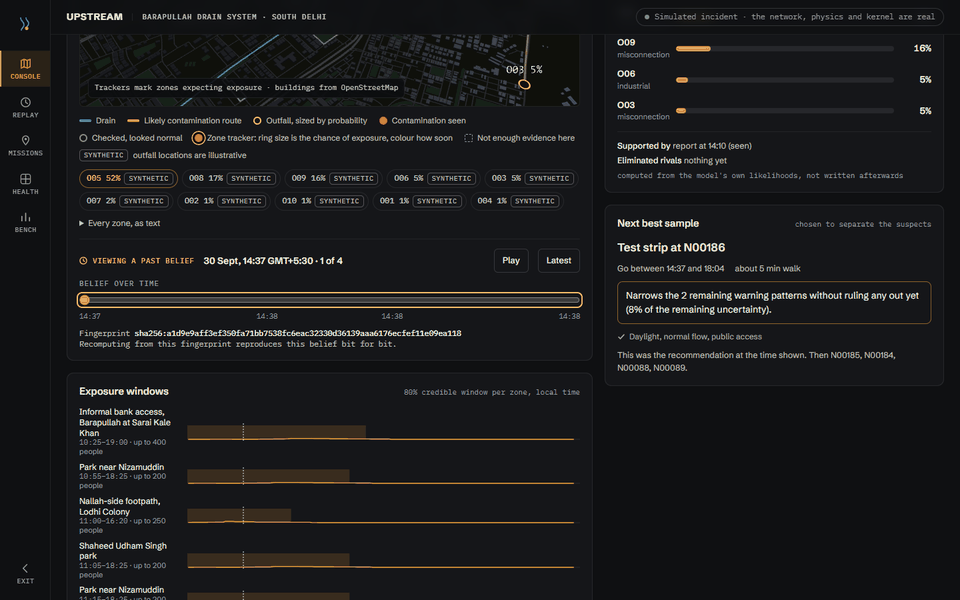
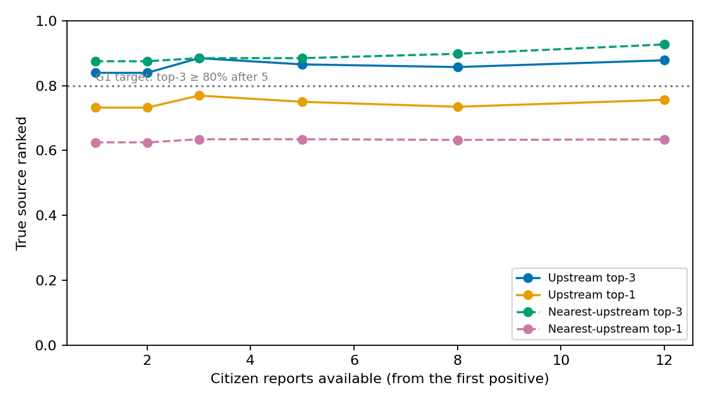
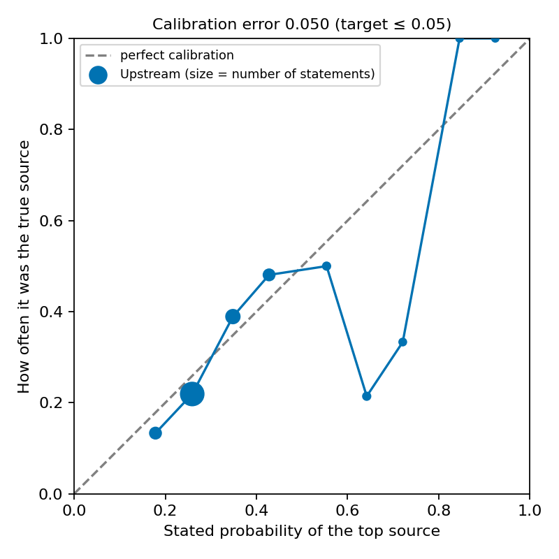
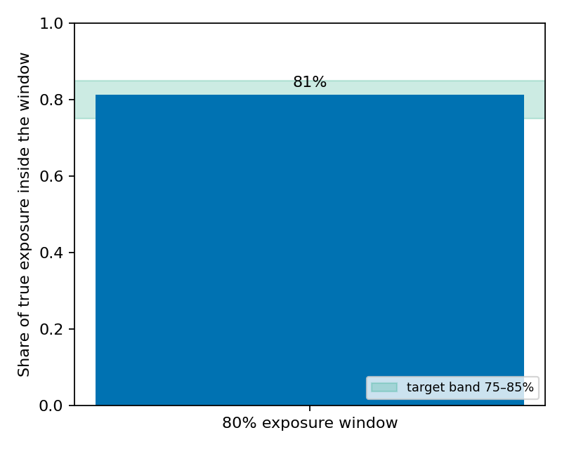
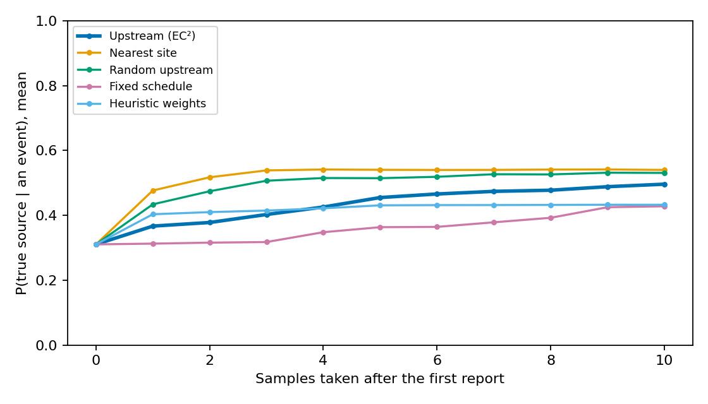
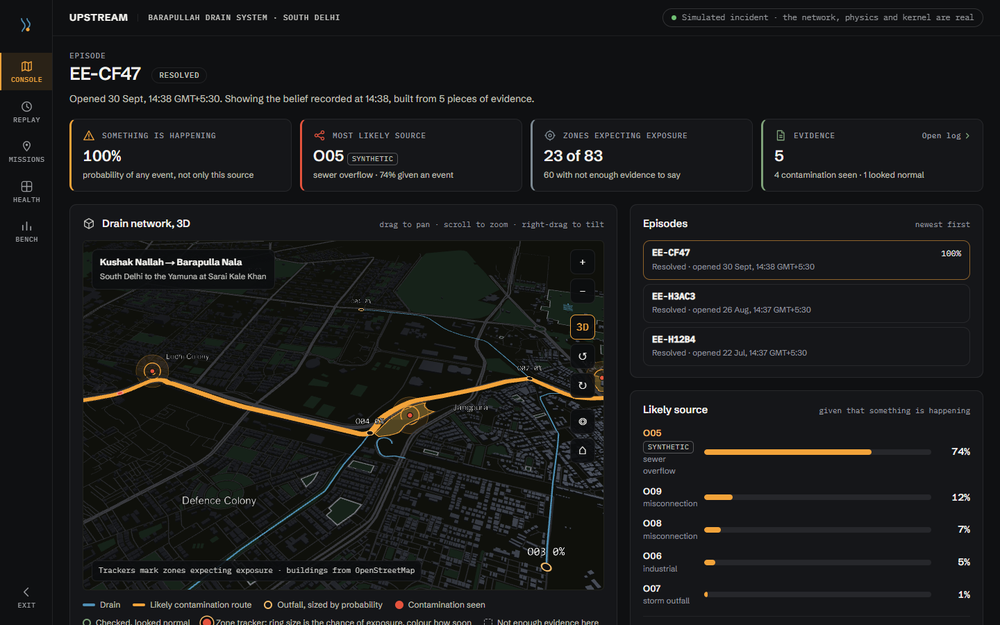
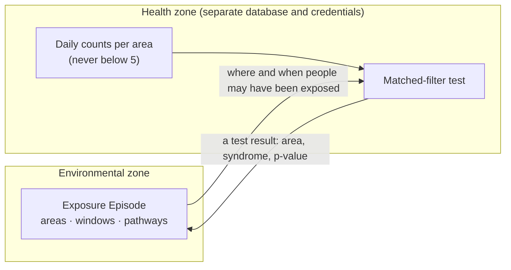

# Upstream (`upstream-onehealth`)

**Upstream is an event-driven One Health system for urban streams.**

When contamination briefly enters a stream (a sewer overflow, a misconnected pipe, an
illegal discharge), Upstream works out four things:

1. **TRACE**: where it probably came from.
2. **PULSE**: where it is going, and when each downstream area is plausibly exposed.
3. **PROBE**: where the next observation would reduce uncertainty most, and who can take
   it.
4. **BRIDGE**: when it matters for human health, and how to tell health systems in HL7
   FHIR.

It keeps one shared object between the stream and the clinic, the **Exposure Episode**,
and publishes it as validated FHIR resources that extend the OneAquaHealth
Implementation Guide.

Built for the IEEE OneAquaHealth Global Hackathon 2026, **Track 7: Digital Health
Standards**. See [how it meets the track](docs/TRACK7_ALIGNMENT.md).



## Quickstart

You need Docker, [uv](https://docs.astral.sh/uv/) and about 8 GB of free memory.

```bash
cp .env.example .env    # then set the passwords (any strong values), and
                        # JWT_SIGNING_KEY and EXPORT_PSEUDONYM_KEY (openssl rand -hex 32)
make up                 # PostgreSQL, the API, the kernel, the health zone, HAPI FHIR, the web app
make migrate            # both databases
make compile            # the Barapullah drain network from OpenStreetMap (needs internet)
make tables             # travel-time and dilution tables
make env-host           # .env.host, for commands run on the host
make fhir-load          # the OneAquaHealth IG and Upstream's profiles into HAPI
make demo               # the PRD 10.5 incident, replayed and checked beat by beat
```

Then open <http://localhost:3000>. `make demo` rebuilds the web app to show the
simulated stream.
- Run the demo in daylight (07:00–20:00 Delhi time): Upstream never sends a volunteer out
  after dark.

`make demo` prints each beat of the incident, from the storm to the recurring-source
report, as PASS, FAIL or SKIP. A full run ends `12 passed, 0 failed, 0 skipped` in about
four minutes. Before running the test suite after a demo, run `make demo-end`.

## What is real, and what is simulated

- **Real:**
  - the drain network, the Kushak Nallah and Barapulla Nala in South Delhi, compiled from
    OpenStreetMap;
  - every line of the system that reasons about it.
- **Simulated:**
  - every incident, report and clinical count;
  - every outfall's position (no public register exists for these drains; each outfall
    is badged as synthetic).

The evaluation validates the method under its assumptions, not field performance.
[ASSUMPTIONS.md](docs/ASSUMPTIONS.md) lists every simplification.

## Results

200 simulated incidents on the real network, with ground truth the kernel cannot read
(`bench/results/summary.json`, re-run with `make bench`):

| | Target | Result |
|---|---|---|
| Top-3 source accuracy after 5 reports | ≥ 80% | **86.5%** (the nearest-upstream heuristic: 88.5%) |
| 80% exposure windows that contain the truth | 75–85% | **77.6%** |
| Calibration error | ≤ 0.05 | **0.050** |
| Samples to localise, against the best baseline | 30% fewer | **21% more (not met)** |
| Clinical detection delay | shorter than a blind cluster scan | **6.5 days** vs 9.2 |
| False episodes | low | **0** per catchment-month |
| Evidence to updated belief, p95 | < 5 s | **2.8 s** |

Two targets are not met, and the reasons are reported rather than tuned away:
- PROBE's sampling does not yet beat simple strategies on this network.
- A nearest-upstream rule is competitive on its narrow drains.

See [ASSUMPTIONS.md](docs/ASSUMPTIONS.md#the-evaluation-is-on-synthetic-data).

| | |
|---|---|
|  |  |
|  |  |

## Standards conformance

- **FHIR R4 profiles derived from the OAH IG** (`hl7.eu.fhir.oah`):
  - the Exposure Episode (`RiskAssessment`);
  - evidence (`Observation`);
  - exposure zones (`Location`) and their populations (`Group`);
  - aggregate syndromic counts (`MeasureReport`);
  - `Provenance`;
  - an episode-state `Subscription` (R4 backport).
- **Zero HL7 validator errors**, checked on every push by the `fhir` CI job
  (`./fhir/scripts/validate.sh`), and again by `$validate` on every write.
- **CDS Hooks** at `GET /cds-services` (`patient-view`, `encounter-start`): a card only
  when a patient's area, timing and syndrome all match an episode, answered in under
  500 ms, with an `AuditEvent` per card.

Details, with a link per claim: [TRACK7_ALIGNMENT.md](docs/TRACK7_ALIGNMENT.md).

## How it works



An append-only PostgreSQL event log is the only source of truth. On every new piece of
evidence a JAX kernel recomputes an **exact posterior** over about 11,500 hypotheses
(which outfall, when, how much). It writes a fingerprinted snapshot: recomputing the
same evidence gives the same belief, bit for bit.

Durable workflows take episodes through their lifecycle, from minutes to weeks:

| State | When |
|---|---|
| SUSPECTED | P(event) ≥ 0.5 |
| PROBABLE | P(event) ≥ 0.9 |
| CONFIRMED | an officer signs off on a positive test |
| RESOLVED | 16 days after exposure |

A separate health-zone service holds only aggregate counts and sends back only a test
result.

"Looks normal" is evidence: it rules out every hypothesis that would have reached that
point, which is how one quick check by a volunteer can clear a whole branch of the drain.

[ARCHITECTURE.md](docs/ARCHITECTURE.md) has the diagram and the details.

## Where AI is and is not used

| Task | Method | AI (language model)? |
|---|---|---|
| Turning free text or a photo into structured observation fields | Language model with a fixed schema; the citizen confirms every field; Provenance records model and version | Yes, proposals only |
| Source inference, exposure windows, sampling choice | Exact Bayesian computation, physics tables, EC² | No |
| Observer reliability, detection curves, velocity calibration | Hierarchical Bayesian models (NumPyro), offline | No (statistical learning) |
| Clinical signal | Statistical test (negative-binomial baseline, matched filter) | No |
| Explanations in the UI | Templates filled from computed values; every number checked against engine state | Optional wording only |
| Episode state changes and publishing | Rules and human sign-off | No |

*AI proposes, physics and statistics compute, rules validate, FHIR standardises, humans
decide.*

In this build the language-model path has not been exercised live. With no API key, a
deterministic stub proposes the fields.

## Privacy and safety



- No patient-level data leaves the health zone.
- Volunteers share a neighbourhood, never a location.
- Public views never show who reported something, or any photo.
- Upstream never issues advisories, never contacts patients and never names a polluter;
  its reports suggest places to inspect.
- Every health-facing output says ***"Environmental context, not a diagnosis."***

See [PRIVACY.md](docs/PRIVACY.md) and [SECURITY.md](docs/SECURITY.md).

## Repository

```
packages/upstream-shared/   Schemas and code constants shared by every service. No I/O.
services/core-api/          FastAPI: ingestion, episodes, missions, FHIR, CDS Hooks, reports
services/kernel/            JAX worker: network compiler, physics, TRACE / PULSE / PROBE, pooling
services/clinical-stats/    The health zone: aggregates in, test results out
services/simulator/         Incidents with hidden ground truth; the scripted demo
services/bench/             Benchmarks, baselines and the CI gate
fhir/                       FSH profiles, the vendored OAH IG, validation scripts
db/                         Migrations for both databases
web/                        Next.js console, belief replay, mission PWA
docs/                       Architecture, assumptions, Track 7, privacy, security, demo script
```

Tests: `make test` in the containers, or `uv run pytest` on the host after
`make env-host`. Continuous integration runs four jobs on every push: python, fhir
(validator), bench (calibration gate) and web.

The network the results were computed on (`16811181e3006ac9`) is committed at
`bench/fixtures/network.npz`. `make compile` fetches today's OpenStreetMap, which may
differ slightly.

## Licence and citation

Apache License 2.0; see [LICENSE](LICENSE). To cite, see [CITATION.cff](CITATION.cff).
OpenStreetMap data © OpenStreetMap contributors, ODbL.

The product requirements are in [PRD.md](PRD.md); the build plan is in
[docs/superpowers/plans/](docs/superpowers/plans/).
