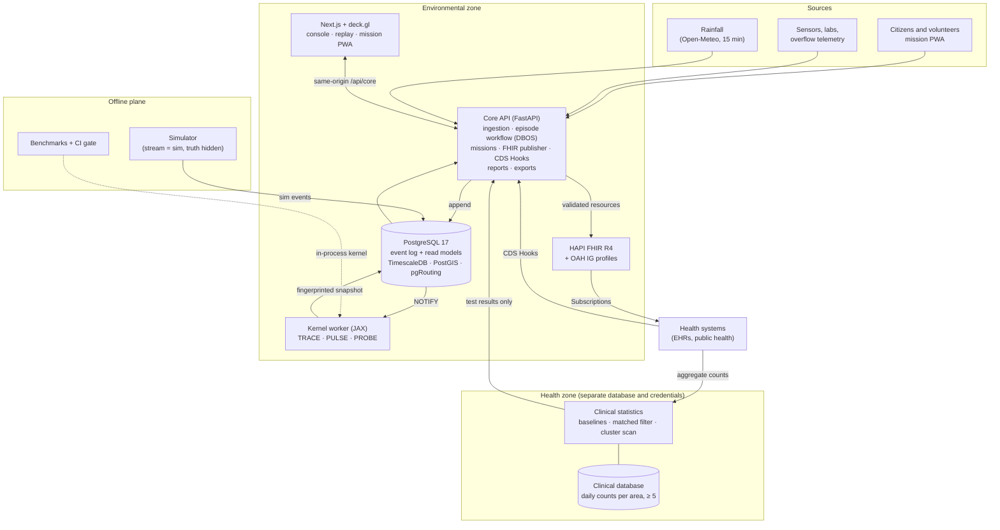

# Architecture

Upstream is event-sourced.
- An append-only log is the only source of truth.
- The kernel turns the log into beliefs.
- A workflow layer turns beliefs into episodes, missions and published FHIR.

Everything else (maps, exports, the FHIR store) is a view that can be rebuilt from the
log.

## The event log

`events` is written only through `append_event(...)`. It hands out a strictly
increasing sequence number under an advisory lock, so commit order is log order. No
role may update or delete an event (GC-5). A correction or retraction is a new event.

Every observation carries two times: when it was observed (`event_time`) and when it was
recorded (`recorded_at`, GC-4). A phone that was offline for an hour still reports what
it saw at the time it saw it.

Each event belongs to a **stream**:
- `live` is real data;
- `sim` is the simulator's.

Every consumer keys its cursor by catchment and stream, so a simulated incident never
moves a live cursor and never shapes a live belief (GC-10). The simulator's ground truth
sits in a schema the kernel's database role cannot read.

## The kernel

On every new evidence event the worker recomputes the posterior **from the full evidence
set in a 24-hour horizon**, not incrementally (GC-6). It writes a snapshot whose
fingerprint is a hash of the evidence, the network, the parameters and the kernel
version. Recomputing the same evidence gives the same fingerprint, bit for bit (CPU,
fast-math off, pinned versions).

- **TRACE**: the exact posterior over roughly 11,500 hypotheses (source × start time ×
  release size, plus "diffuse runoff" and "nothing happened"). Each observation's
  likelihood uses precomputed travel-time and dilution tables per flow condition.
  Negative evidence counts: "looks normal" at a point rules out the hypotheses that would
  have reached it.
- **PULSE**: for each exposure zone, the probability of exposure over time and an 80%
  credible window.
- **PROBE**: the next check worth making, by Equivalence Class Edge Cutting (EC²) over
  decision classes (which zones need a warning). It is limited to places that are
  reachable, public and safe: daylight, no storm (PRD 7.5).
- **Priors** combine the outfall type's base rate, rainfall (a storm raises
  combined-sewer overflows, a dry-weather event points to misconnections), the first
  flush after a dry spell, and how often each outfall has been implicated before
  (pooled from closed episodes).

The kernel's database role can read evidence and write snapshots, and nothing else. It
cannot write episodes (PRD 10.3).

## The workflow layer (Core API)

- **Episodes.** A consumer reads each new belief:
  - it opens an episode when P(event) ≥ 0.5;
  - moves it to PROBABLE at ≥ 0.9;
  - and REFUTED below 0.1.

  CONFIRMED needs a named officer and a positive field or lab result (FR-21). RESOLVED
  comes 16 days after exposure (FR-22), from a durable DBOS timer backed by a sweep, so a
  lost timer delays a deadline but never drops it. A confirmed episode schedules a
  bioassessment survey (FR-24). An episode reopens on new evidence only within the
  evidence horizon; after that, a new belief is a new episode.
- **Missions.** PROBE's candidates become missions for the nearest available volunteer,
  routed on footpaths (pgRouting, OR-Tools). A missed window expires and the plan is
  redone. Once the kernel has recomputed with the volunteer's reading, the volunteer is
  told what it changed (G7).
- **FHIR.** Every state change publishes the episode, its evidence, zones and provenance
  to HAPI, validating each resource first. CDS Hooks answers from memory within 500 ms.
- **Reports and exports.** The nightly recurring-source report, and Parquet exports with
  pseudonymised observers.

## The health zone

A separate service, database and credential (GC-7). It accepts only summary
`MeasureReport`s about a population `Group`: daily counts per area, never below five. It
fits a negative-binomial baseline per area and syndrome, and tests each active episode's
predicted case curve with a matched filter. **Only the test result crosses back.** It
also scans blindly for clusters, and asks the kernel to search upstream of one it cannot
explain. The environmental side never sees a count.

## The web app

Next.js 14, deck.gl, and a self-hosted OpenStreetMap basemap (no tile key). The browser
talks only to its own origin (`/api/core`, rewritten to the Core API), so the service
worker can queue mission submissions while offline. The TypeScript types are generated
from the API's OpenAPI schema, so a renamed field breaks the build, not a phone.

## Containers

| Service | Image | Role |
|---|---|---|
| `db` | timescaledb-ha pg17 | Event log, read models, clinical database (separate DB and role) |
| `api` | Python 3.12 | Core API, episode workflow, missions, FHIR, CDS Hooks |
| `kernel` | Python 3.12 + JAX (CPU) | The live stream's worker |
| `kernel-sim` | same | The sim stream's worker (profile `demo`) |
| `clinical` | Python 3.12 | Health zone |
| `hapi` | HAPI FHIR JPA R4 | FHIR store with the OAH IG |
| `minio` | MinIO | Photo storage |
| `web` | Node 22 | Console, replay, mission PWA |

## Continuous integration

Four jobs run on every push ([`ci.yml`](../.github/workflows/ci.yml)):

- **python**: ruff, migrations and the full test suite against a real
  PostGIS/Timescale database, including the health-boundary and GC-10 grant tests run
  from each role's own login.
- **fhir**: SUSHI, then the HL7 validator against the OAH IG. Any error fails the build.
- **bench**: the benchmark on the real network. Calibration may not degrade beyond
  tolerance, and accuracy, coverage and sampling may not regress (FR-45).
- **web**: typecheck, unit tests (with axe accessibility checks) and a production
  build.
